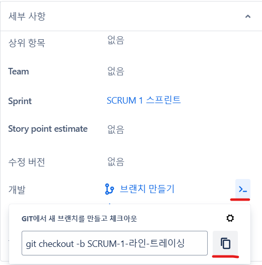

# IVS2기 Final Project
PiRacer를 사용


## 협업 메소드
Jira와 Git을 적극적으로 사용하여 프로젝트를 진행합시다. 


Jira에서 다음의 커맨드를 활용하여 해당 이슈용 새로운 브랜치를 생성할 수 있습니다. 

```shell
git commit -m "SCRUM-# <message>"
``` 
#에 해당하는 스크럼 번호를 사용하여 커밋을 해당 스크럼에 할당할 수 있습니다. 